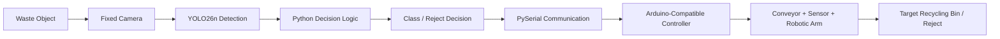

# ♻️ Smart Recycle AI-Hub

### AI-Powered Waste Detection and Robotic Sorting Prototype

Smart Recycle AI-Hub is a university-scale smart recycling prototype that combines **artificial intelligence, computer vision, Python, YOLO, sensors, conveyor control, embedded systems, and robotic sorting**.

The V1 system uses a fixed camera and a trained **YOLO26n** object-detection model to identify recyclable waste. The AI layer is being developed as part of a complete physical sorting pipeline that will connect computer vision with an Arduino-compatible controller, conveyor system, sensors, and a robotic arm.

---

## 🔄 System Architecture



The complete V1 workflow is designed around a simple principle:

**Detect → Decide → Communicate → Sort**

---

## 🚀 Project Status

**Current Stage:** AI detection and software inference completed — decision logic and physical-system integration are the next development stages.

| Component | Status |
| --- | --- |
| Dataset preparation | ✅ Completed |
| Dataset validation | ✅ Completed |
| YOLO26n training | ✅ Completed |
| Model validation | ✅ Completed |
| Python inference | ✅ Completed |
| Streamlit testing interface | ✅ Completed |
| Automated tests | ✅ Completed |
| Decision & reject logic | 🔄 In Progress |
| Live camera inference | ⏳ Planned |
| PySerial communication | ⏳ Planned |
| Arduino integration | ⏳ Planned |
| Conveyor integration | ⏳ Planned |
| Sensor integration | ⏳ Planned |
| Robotic arm integration | ⏳ Planned |
| Physical sorting test | ⏳ Planned |
| Integrated V1 prototype | ⏳ Planned |

---

## 🎯 V1 Goal

The goal of V1 is to build and verify a complete prototype capable of detecting and sorting four recyclable waste categories:

- Plastic
- Metal
- Glass
- Paper / Cardboard

The prototype is intentionally limited to these four categories so that the complete AI-to-hardware pipeline can be tested before expanding the project.

Objects that do not satisfy the required detection criteria will be handled by the Python decision layer and routed to a **Reject** path.

---

## 🧠 Waste Classes

The V1 YOLO model is frozen to four detection classes:

```text
0: plastic
1: metal
2: glass
3: paper_cardboard
```

> **Important:** `Reject` is not a YOLO class.

Unknown, unsupported, or low-confidence detections will be handled separately by the Python decision logic.

---

## 📊 AI Model Performance

The first official **YOLO26n V1 baseline** was trained on the project's validated recycling dataset.

| Metric | Result |
| --- | ---: |
| Precision | **0.809** |
| Recall | **0.747** |
| mAP50 | **0.802** |
| mAP50-95 | **0.452** |

### Training Configuration

```text
Model:       yolo26n.pt
Epochs:      80
Image size:  640
Batch size:  16
Device:      CUDA GPU
```

### Dataset Summary

| Dataset Split | Images | Objects |
| --- | ---: | ---: |
| Training | **15,148** | **83,850** |
| Validation | **1,268** | **2,086** |

The dataset preparation process includes:

- label validation
- class validation
- bounding-box validation
- duplicate-label analysis
- train/validation leakage analysis
- final split verification

Detailed dataset documentation is available in:

```text
docs/DATASET_PREPARATION_V1.md
docs/DATASET_SOURCES.md
docs/LABELING_GUIDE.md
```

Detailed training documentation is available in:

```text
docs/YOLO26N_TRAINING_V1.md
```

---

## 🛠️ Core Technologies

### Artificial Intelligence & Computer Vision

`Python` · `YOLO26n` · `Ultralytics` · `OpenCV` · `PyTorch`

### Interface & Testing

`Streamlit` · `Pytest`

### Planned Hardware Integration

`Arduino` · `PySerial` · `Sensors` · `Conveyor System` · `Robotic Arm`

### Development Tools

`Git` · `GitHub` · `VS Code`

---

## 🧩 AI Inference Layer

The main inference module is implemented in:

```text
ai/inference.py
```

It currently supports:

- loading the trained `best.pt` model
- validating the four V1 classes
- running YOLO inference on images
- extracting detected class names
- extracting confidence scores
- returning YOLO detection results to the interface

---

## 🖥️ Streamlit V1 Image Tester

A Streamlit-based testing interface is implemented in:

```text
ai/streamlit_app.py
```

The interface currently supports:

- uploading multiple waste images
- selecting an uploaded image for analysis
- displaying the original image
- displaying the YOLO-annotated result
- displaying detected classes
- displaying confidence scores
- displaying detection results in a table
- counting currently uploaded images
- counting unique images tested during the session
- counting total detections
- preventing duplicate session counting after Streamlit reruns
- resetting the testing session
- side-by-side original and detection-result views

Detailed documentation:

```text
docs/AI_INFERENCE_STREAMLIT_V1.md
```

---

## ▶️ Running the Streamlit Tester

### 1. Activate the virtual environment

On Windows:

```cmd
.venv\Scripts\activate
```

### 2. Start Streamlit

```cmd
python -m streamlit run ai\streamlit_app.py
```

If the system Python does not point to the project's virtual environment, run:

```cmd
.venv\Scripts\python.exe -m streamlit run ai\streamlit_app.py
```

Streamlit normally opens at:

```text
http://localhost:8501
```

You can then upload real waste images and run inference using the trained model.

---

## 🧪 Automated Tests

Run the complete automated test suite with:

```cmd
python -m pytest -q
```

The current tests cover the AI inference and Streamlit workflow, including:

- V1 class configuration
- trained-model path
- model loading
- image inference
- detection extraction
- image preparation
- multi-image upload
- image selection
- session statistics
- duplicate session-counting protection
- reset behavior
- interface layout

---

## 📁 Repository Structure

```text
smart-recycle-ai-hub/
│
├── ai/
│   ├── inference.py
│   ├── streamlit_app.py
│   └── README.md
│
├── config/
├── data/
├── docs/
│   └── evidence/
├── img/
├── logs/
├── scripts/
├── tests/
│
├── .gitignore
├── requirements.txt
└── README.md
```

The repository separates source code, documentation, datasets, scripts, tests, evidence, configuration, and generated outputs.

---

## 📦 Large Files and Local Data

Large datasets, generated training outputs, virtual environments, local configuration files, and trained model weights are intentionally excluded from Git.

Examples include:

```text
*.pt
runs/
data/raw/
data/processed/
data/interim/
data/inspection/
data/benchmarks/
.venv/
.env
.vscode/
__pycache__/
*.pyc
```

This keeps the repository lightweight while preventing local or generated files from being committed accidentally.

---

## 🤖 Trained Model Location

The current V1 model is expected locally at:

```text
runs/detect/runs/waste_v1/yolo26n_v1_baseline/weights/best.pt
```

The trained `best.pt` file is intentionally not stored in the Git repository.

A collaborator who wants to run inference must obtain the trained weights separately and place them in the expected local path, or update the model-path configuration accordingly.

---

## 📚 Documentation

The project includes dedicated technical documentation for each major development stage.

```text
docs/PROJECT_SCOPE_V1.md
docs/DATASET_PREPARATION_V1.md
docs/DATASET_SOURCES.md
docs/LABELING_GUIDE.md
docs/YOLO26N_TRAINING_V1.md
docs/AI_INFERENCE_STREAMLIT_V1.md
docs/EXTERNAL_BENCHMARK_V1.md
docs/AI_SETUP.md
ai/README.md
```

Additional validation and experimental evidence is stored under:

```text
docs/evidence/
```

---

## 🛣️ Development Roadmap

The immediate V1 development path is:

```text
YOLO26n Detection
        ↓
Confidence Threshold
        ↓
Best-Detection / Decision Logic
        ↓
Reject Handling
        ↓
Live Camera Inference
        ↓
PySerial Communication
        ↓
Arduino Integration
        ↓
Conveyor + Sensor Integration
        ↓
Robotic Arm Integration
        ↓
Physical Sorting Test
        ↓
Integrated V1 Prototype
```

Real-world observations from the integrated prototype will be documented before deciding whether additional model training or dataset expansion is necessary.

New waste classes should not be added until the complete V1 pipeline has been integrated and tested successfully.

---

## 🔬 Development Principles

The project follows several practical principles:

- Validate data before training.
- Test the model on data outside the training pipeline.
- Keep AI inference separate from hardware-control logic.
- Use automated tests for software behavior where possible.
- Document experiments and evaluation results.
- Avoid expanding scope before the V1 pipeline works end-to-end.
- Treat unknown or uncertain detections safely through a reject path.
- Keep generated datasets, model weights, and local environments outside Git.

---

## 🌱 Future Development

After the complete V1 prototype is operational, future work may include:

- real-time camera processing
- improved confidence and decision policies
- physical timing calibration
- conveyor speed synchronization
- robotic-arm motion optimization
- additional external testing
- model retraining based on real-world observations
- expansion to additional waste categories
- improved operator interface
- hardware safety improvements

These additions will be considered only after the core V1 system is validated.

---

## 📄 License

This repository currently does not include an open-source license.

Unless a license is added later, the source code should not be assumed to grant permission for redistribution, modification, or commercial reuse.

---

## 💡 Project Principle

> **Build and verify the complete V1 pipeline before expanding the scope.**

**We can do it.**
